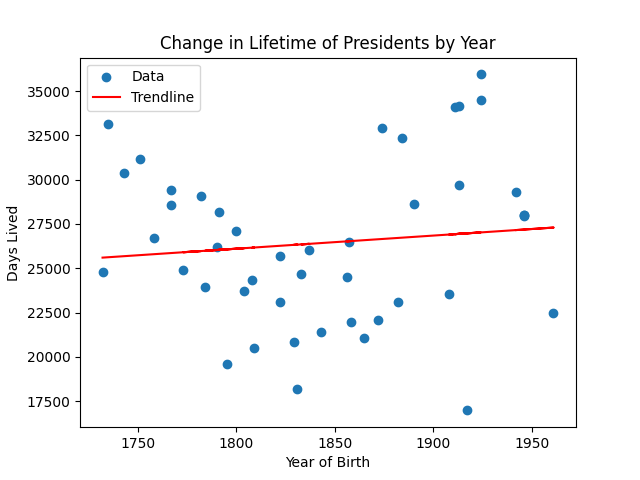

# A Problem with Presidents; a data-to-information challenge.
Report by Samantha Emerson

2-27-2023

## Introduction

This report condenses the data of U.S. President birth vs death dates into tables and a graph that can track the length of life for each president. The data was taken from [presidentsusa.net](https://www.presidentsusa.net/birth.html). Overall, outside of a few outliers due to illness or assassination, presidential lifetimes have grown longer over the centuries. This reflects the increase in lifespan for U.S. citizens over time as well.

### Figures and Tables

Figure 1: Data visualized via scatter plot

In this figure, we can see that overall, the length of a U.S. President's life has generally increased over time, though at the beginning of the industrial revolution in 1793 the lifespan trend experienced a dip. One reason for the apparently shorter lifespans after 1900 is because these presidents have not yet died, and so the length of their life is artificially shorter since their life cutoff is the present day.

*Note: All graphs and tables are up-to-date as of February 27, 2023. All presidents are included in each analysis, including those that are still alive.*

Table 2: List of Shortest-Lived Presidents
| NAME         |        DAYS LIVED     |
| --- | --- |
| John F. Kennedy    |  16978          |
| James A. Garfield  |  18202          |
| James K. Polk      |  19583          |
| Abraham Lincoln    |  20516          |
| Chester Arthur     |  20863          |
| Warren G. Harding  |  21091          |
| William McKinley   |  21412          |
| Theodore Roosevelt |  21985          |
| Calvin Coolidge    |  22099          |
| Barack Obama       |  22487          |

Table 3: List of Longest-Lived Presidents
|NAME               |  DAYS LIVED     |
| --- | --- |
|Jimmy Carter       |  35943          |
|George Bush        |  34504          |
|Gerald Ford        |  34133          |
|Ronald Reagan      |  34088          |
|John Adams         |  33119          |
|Herbert Hoover     |  32943          |
|Harry S. Truman    |  32373          |
|James Madison      |  31150          |
|Thomas Jefferson   |  30397          |
|Richard Nixon      |  29688          |

For this table, I converted each president's birth date and death date into a datetime, and subtracted each birth date from the death date. The shortest-lived president, for example, lived 16,978 days, or 46 and a half years. The longest-lived president lived 35,943 days, more than twice as long, for a total of nearly 98 and a half years.

President Obama is on the shortest-lived list because he is still alive, and has only lived 22,487 days (or just over 61 and a half years) up to today.

### General stats on lifespan:

| Type of data | Length of time (or name) |
| --- | --- |
| Mean lifetime: | 26,433 days / 72 years|
| Weighted average is: | 26,433.38 days|
| Median lifetime in days is: | 24,676 days|
| Mode of lifetimes is: | All values are unique; no days|
| Shortest-Lived President (Name, Days): | John F. Kennedy, 16,978|
| Longest-Lived President (Name, Days): | Jimmy Carter, 35,943|
| Standard deviation is: | 435.02|

## Conclusion

In conclusion, on average, presidents have lived roughly 72 years. This includes outliers due to illness or assassination, since these are human dangers that presidents face. The median being lower than the mean implies that presidents are more likely to live less than 72 years, but if they live longer than that, then they live for significantly longer. 